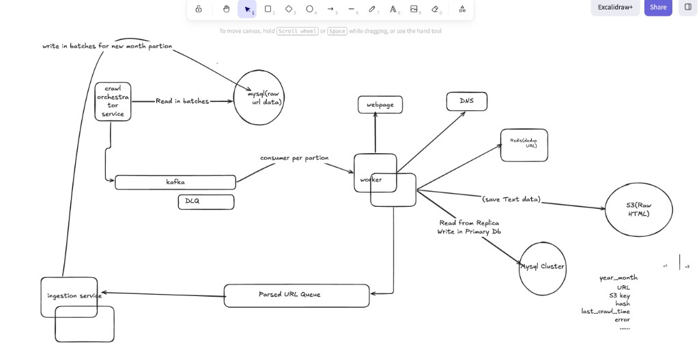

# Design doc: Billion-URL Metadata Collection at Scale (Parts 2 + 3)

## Story / context

Imagine it’s the first day of the month. A partner team drops a **year-month batch** (e.g. `2026-07`) containing **~1 billion URLs** that we must fetch and extract **HTML metadata** from—reliably, cost-effectively, and with a clean query layer so internal consumers can ask questions like:

- “When did we last crawl this URL?”
- “What title/description/body snippet did we see?”
- “How many URLs were blocked this month, and by which domains?”

The system is essentially a **factory line**:

1. **Ingest** the month’s URLs.
2. **Deduplicate** so we don’t waste bandwidth.
3. **Fetch** content (HTTP-first; browser only when needed).
4. **Parse** metadata.
5. **Store** both metadata (queryable) and raw HTML (replayable).
6. **Observe** progress and failure modes so we can complete each month’s batch within an agreed window.

This document explains the design choices with sizing math, and then lays out a pragmatic **POC plan** (Part 3).

---

## Functional requirements

- **FR1: Batch ingestion**
  - Accept a list of URLs for a given `year_month` from a text file and/or MySQL.
  - Support incremental ingestion (pagination + checkpoints).
- **FR2: Crawl and parse**
  - For each URL attempt:
    - fetch HTML (handle redirects)
    - extract metadata: `title`, `description`, `body snippet`, plus fetch diagnostics
- **FR3: Storage**
  - Store metadata in a unified schema (queryable).
  - Store raw HTML content in blob/object storage.
- **FR4: Query API**
  - Support high read volume for metadata lookups (millions of requests).
  - Support queries by URL and “last crawled” style lookups.
- **FR5: Dedup**
  - Prevent re-fetching the same normalized URL within the month (TTL policy).
  - Detect duplicate content via `content_hash`.
- **FR6: Replay / retry**
  - Allow replaying failed URLs and reprocessing existing HTML (from blob storage).
- **FR7: Observability**
  - Track progress per `year_month` and per domain.
  - Provide error classification (403 blocked, timeout, DNS, etc.).
- **FR8: Control FanOut and Depth**
  - It can be case we want to control per seed url fanout or depth upto which we want to explore.

## Non-functional requirements

- **NFR1: Scale**
  - Handle **~1B URLs/month** continuously.
- **NFR2: Cost**
  - Use low-cost storage for bulky HTML (object storage).
  - Prefer cheap HTTP fetch; reserve expensive browser fetch for a small fraction.
- **NFR3: Reliability**
  - Gracefully handle partial failures (timeouts, blocks, transient network errors).
  - Ensure idempotent processing and safe replays.
- **NFR4: Availability**
  - Metadata query API remains available under load (read-heavy).
- **NFR5: Performance**
  - latency under 500 ms for point lookups and recent-month queries.
- **NFR6: Operability**
  - Clear metrics, dashboards, alerts; controlled backpressure.

---

## Back-of-the-envelope sizing calculations (why these choices)

### Assumptions

- **Volume**: 1 billion URLs per month (year-month partitions)
- **Average metadata record size** (rough): ~300 bytes (URL, timestamps, hashes, title/description, status fields)
- **HTML content**: potentially large and variable → store in object storage, not relational DB
- **Content scope**: we only store and reason about **textual HTML content** (no image/video blobs); media URLs may be recorded as links but binary data is not ingested in this design.
- **Dedup**:
  - **URL-level dedup**: avoid re-fetching same normalized URL within a month
  - **Content-level dedup**: detect identical/near-identical content using content hash

### URL list storage size

### URL list storage size

If average URL storage is ~250 bytes:

$$250 \text{ B/URL} \times 10^9 \approx 250 \text{ GB/month}$$

So storing the raw monthly URL list is not the main challenge; **processing and querying** are for which we can use simple patiotined by time MYSQL cluster with multiple read replicas .

### Throughput required

If we want to finish 1B URLs in ~30 days:

$$\frac{10^9}{30 \times 24 \times 3600} \approx 385 \text{ URLs/sec (sustained)}$$

If we want to finish in 7 days:

$$\frac{10^9}{7 \times 24 \times 3600} \approx 1653 \text{ URLs/sec}$$

This throughput drives worker count and outbound bandwidth.

### Worker concurrency estimate

Let’s assume average fetch+parse time:
* HTTP pages: ~1s (best-case) to ~5s (typical)

If p95 is ~3s and we need ~1650 URLs/sec (7-day target):

$$\text{concurrency} \approx 1650 \times 3 \approx 4950$$

That suggests thousands of concurrent fetch slots across the fleet (split into pools).

### HTML storage in S3

If we store only a subset (e.g., 20KB compressed average) for successful pages:

$$20 \text{ KB} \times 10^9 \approx 20 \text{ TB/month}$$

This is realistic for object storage with lifecycle policies; it’s not suitable for OLTP databases.

### Metadata DB size

If one metadata row averages ~300 bytes:

$$300 \text{ B} \times 10^9 \approx 300 \text{ GB/month}$$

Over 12 months: ~3.6TB; over 5 years: ~18TB. Storage is manageable, but **indexes and query patterns** dictate the DB choice. So we are going with Mysql cluster only as its already in our ecosystem (reading input from it) and it for read queries scale we can add replica and all cloud providers provide sufficient support up to 64 TB DB size. 

---

## Architecture (full flow)

### Diagram

### Why Kafka

Kafka gives us:
- replayability (“re-run July”)
- controlled backpressure
- DLQ patterns for bad URLs
- easy horizontal scaling of workers by partition

Given our throughput math (hundreds to thousands URLs/sec sustained), a durable queue is necessary.

### Why Redis/Bloom for monthly dedup

Dedup is a **cost control lever**: without it, reprocessing duplicates explodes bandwidth + compute.

At 1B scale, plain Redis `SET` for every URL can be expensive due to overhead. A practical approach is:
- Bloom filter per month (cheap membership check)
- optional exact-set for high-value URLs where false positives are unacceptable
- Redis have support for Bloom filter also so we can use that

### Why S3 for HTML

HTML is big and variable; object storage is cheap and supports lifecycle policies. It also enables **replay parsing** without re-fetching the internet.

### Why a separate metadata store

Metadata drives “millions of requests” query workloads. That’s a different shape than blob storage:
- point lookups by URL
- “last crawled” queries
- host/month-level filters

We therefore store:
- **hot query fields** in the metadata store
- full HTML in S3 with a pointer in metadata

---

## Data model (unified schema)

### URL normalization + hashes

- `normalized_url`: canonicalized form used for dedup
- `url_hash`: stable hash of `normalized_url`
- `content_hash`: hash of HTML content (for duplicate content detection)

### Metadata schema (example)

- `year_month` (int `YYYYMM`) — partition key
- `url`, `normalized_url`, `url_hash`, `host`
- `crawl_time`
- `fetch_status_class` (ok, http_4xx, http_5xx, timeout, dns, tls, blocked, protocol_error, other)
- `http_status` (nullable)
- `duration_ms`
- `title`, `description`
- `content_hash` (nullable)
- `s3_key` (nullable; only when we store the body)

Indexes that align to query patterns:
- `(year_month, url)` for monthly point lookups
- `(url_hash)` in a “latest crawl” table/materialized view
- `(year_month, host, crawl_time)` for domain/month analysis

---

## Processing logic

### Ingestion producer

- Reads from MySQL in pages by PK
- Publishes to kafka with key = `url_hash`
- Stores a checkpoint so it can resume safely (see **Crash recovery / checkpointing**)
- Applies backpressure based on:
  - Kafka lag
  - worker saturation
  - metadata DB write latency / replication lag

### Crash recovery / checkpointing (if the MySQL reader crashes mid-month)

We assume the ingestion producer can crash at any point (deploys, host loss, OOM). We need a durable “snapshot” of progress so we can resume without re-reading an entire month.

**What we store (per `year_month`)**

- **cursor**: last successfully *published* MySQL PK (or `(pk, updated_at)` for late updates)
- **batch metadata**: batch size, publish timestamp, producer instance id
- **optional**: checksum/count of rows published for audit

**How we store it (options + trade-offs)**

- **Option A: MySQL checkpoint table (simplest, strong consistency)**
  - Table: `ingestion_checkpoint(year_month, last_pk, updated_at, ...)`
  - On publish of a batch, update checkpoint in the same DB (or a dedicated small DB).
  - **Pros**: very simple; easy to inspect/repair; aligns with source-of-truth.
  - **Cons**: couples producer liveness to MySQL; write hot-spot if too frequent (mitigate by checkpointing per batch, not per row).

- **Option B: Kafka compacted topic (producer progress as an event stream)**
  - Topic: `ingestion.checkpoint` (compacted), key=`year_month`, value=`last_pk + metadata`
  - **Pros**: decouples from MySQL; naturally versioned; easy to roll back/inspect history; scales well.
  - **Cons**: operational overhead; you must reason about “published vs committed” state carefully.

- **Option C: Object storage (S3) checkpoint files**
  - Write `s3://.../checkpoints/year_month.json` periodically.
  - **Pros**: very cheap; simple durability; good for audit.
  - **Cons**: not ideal for frequent updates; eventual consistency considerations; harder to coordinate multiple producers.

- - **Option D: Store a status in Mysql per input URL weather a URL is published into queue or NOT**
  - **Pros**: Simple, Just need to maintain one another column in table.
  - **Cons**: For each read now we have to write also in DB and now this DB write would directly core part of crawling which can impact in case DB is slow / down and for each row we have one read and one write. 

**Recommended approach**

- Either Use **Kafka compacted topic** for the canonical checkpoint (Option B), OR store a Checkpoint file in S3.
- Make the producer **idempotent** by ensuring downstream writes are keyed by `(year_month, url_hash)`. That way, even if we re-publish some URLs after a crash, workers can safely upsert without duplicating results.

### Worker pools

Two pools because of cost + reliability:

- **HTTP pool (default)**
  - high concurrency
  - cheaper
  - faster
- **Browser pool (only for “blocked / needs JS”)**
  - limited concurrency
  - expensive
  - used on-demand when HTTP fails with known patterns

### Error classification (clean outputs)

We store a small taxonomy:
- `http_403` (blocked)
- `timeout` / `context_deadline_exceeded`
- `dns`, `tls`, `connection_refused`
- `protocol_error` (e.g., HTTP/2 protocol errors)
- `http_4xx`, `http_5xx`, `other`

We keep:
- `error_breakdown` counts

---

## SLA / SLO

### SLA (external promise)

- **Completion SLA**: For a given `year_month`, All of URLs reach a terminal state (success or classified failure) within **30 days** of ingestion start with properly retried the pages according to error handling .
- **Query API availability SLA**: **99.99999%** monthly availability for read endpoints and p99 read latency should be under 500ms.

### SLOs (internal)

- **Pipeline progress SLO**: p95 “time to terminal status” < 24h once a URL enters Kafka (excluding deliberate holdbacks for rate limiting).
- **Fetch latency SLO**: HTTP pool p95 fetch+parse < 5s for non-bot pages.
- **Queue health SLO**: Kafka lag p95 < 5 minutes of backlog.
- **Dedup SLO**: duplicate re-fetch rate within month < 0.1%.

### How we achieve them

- Since workers are stateless so we can autoscale workers on lag + latency
- separate browser pool so expensive fetches don’t starve the pipeline
- per-host rate limits to reduce bans (which reduces rework)
- DLQ + replay procedures for systematic issues

---

## Monitoring (key metrics + tools)

### System metrics

- CPU/mem/net for:
  - producer
  - HTTP workers vs browser workers
  - Kafka brokers
  - dedup store
  - metadata DB + replicas

### Pipeline metrics

- Kafka lag per topic/partition
- throughput (URLs/sec) by pool
- success/blocked/timeout rates
- retries and DLQ rate
- ingestion cursor (last PK processed for this month)
- storage: S3 PUT errors, bytes/day, compression ratio

### Tools

- Metrics: Prometheus + Grafana (or CloudWatch metrics)
- Logs: structured JSON logs → OpenSearch/Loki
- Tracing: OpenTelemetry (producer → worker → DB/S3)
- Alerting: on lag spikes, blocked spikes, replication lag, DLQ growth, CPU usage, memory Usage, I/O latency, duplicate URL

---

## Part 3: Proof of Concept plan (how we get to production)

### POC objective

Demonstrate that the architecture can:
- ingest a month batch (smaller scale)
- process it reliably with retries and manually push duplicate batch and crash server in b/w
- store metadata + HTML
- provide query endpoints and dashboards

### Scope for POC (2–4 weeks)

- **Scale**: 5–20 million URLs (or smaller if cost-limited)
- **Domains**: include a mix:
  - “easy” pages (static)
  - “redirect heavy”
  - “bot protected” (REI/Amazon-like) to validate classification + browser pool behavior

### Implementation steps

- **Step 1: Data ingestion**
  - MySQL table partitioned by `year_month`
  - Producer reads pages and writes to Kafka with checkpointing
- **Step 2: Worker MVP (HTTP pool)**
  - Fetch, parse metadata, upload to S3, write metadata row
  - Basic retry + backoff
- **Step 3: Dedup**
  - Bloom filter per month + TTL(count number of false +ve metrics)
  - Metrics for dedup hit rate
- **Step 4: Browser pool**
  - Enable for a small allowlist of domains
  - Safety limits (timeouts, max concurrency)
- **Step 5: Query + dashboards**
  - “last crawled” endpoint
  - Grafana dashboard for lag/progress/errors
- **Step 6: Operational hardening**
  - DLQ + replay procedure
  - load tests and failure injection (kill workers, throttle DB)

### Potential blockers (and mitigations)

- **Duplicate URL fetch / re-push** (producer or upstream sending dup rows)
  - Even with dedup, misconfigurations or bugs could cause the producer to re-publish ranges or upstream to resend the same URLs.
  - Mitigation:
    - Strong normalization + hashing and **idempotent writes** keyed by `(year_month, url_hash)`.
    - Kafka keys by `url_hash` so all attempts for a URL land on the same partition/consumer.
    - Metrics on dedup hit rate to detect anomalies.

- **Metadata DB write pressure / hot partitions**
  - Write-heavy workloads (e.g., spikes or hot hosts) can overload the primary.
  - Mitigation (future, if needed): introduce an **async DB writer**:
    - Workers push metadata events to an internal “metadata.write.v1” topic or queue.
    - A pool of writer consumers perform batched inserts/updates to the DB.
    - This decouples fetch latency from DB write latency at the cost of added complexity and slightly delayed visibility.
  - This async writer is **not part of the initial POC**, but the design keeps it as an upgrade path.

- **Bot protection / WAF blocks**
  - Mitigation: classify and surface as `blocked`; keep browser pool limited; consider IP strategy and legal constraints.

- **DB Read Query Slow**
  - Since we already serving query from read replica and directly impacting our system availability so we can add a caching layer with storing hot URL since we already have redis in ecosystem we can leverage that.

- **Browser execution in servers/containers**
  - Mitigation: containerize chromium, pass correct flags (`--no-sandbox`, `--disable-dev-shm-usage`), run a small dedicated pool.

- **Egress bandwidth and cost**
  - Mitigation: dedup early, store only needed HTML, prefer HTTP pool, tune retries.

- **DNS choked / resolver saturation**
  - High QPS to a single DNS resolver can become a bottleneck or lead to throttling.
  - Mitigation:
    - Use **multiple DNS resolvers** (round-robin across providers or internal resolvers).
    - Cache DNS responses aggressively (per-host TTL) in the worker layer.
    - Monitor DNS latency and failure rates as first-class metrics.

### Release plan (quality gates)

- **Gate 1**: correctness on a curated set (metadata extraction + storage pointers)
- **Gate 2**: resilience (replay, DLQ, idempotent writes)
- **Gate 3**: performance (sustained URLs/sec, stable lag)
- **Gate 4**: operations (dashboards + alerts + runbooks)
- **Gate 5**: cost review (browser % usage, S3 volume, egress)

---

## Notes on the Part 1 prototype

This repo’s Part 1 implementation already demonstrates:
- async job submission and polling
- partial results on timeouts
- seed metadata extraction
- optional seed browser fetch + retry strategy for `ERR_HTTP2_PROTOCOL_ERROR`
- clean error summarization

